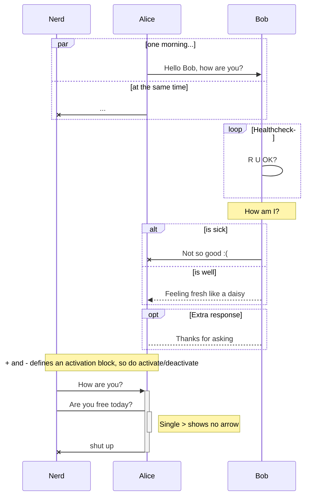
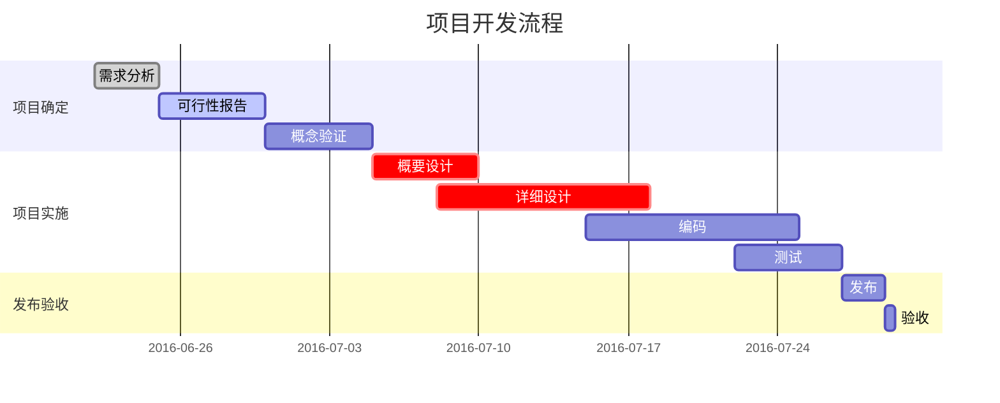
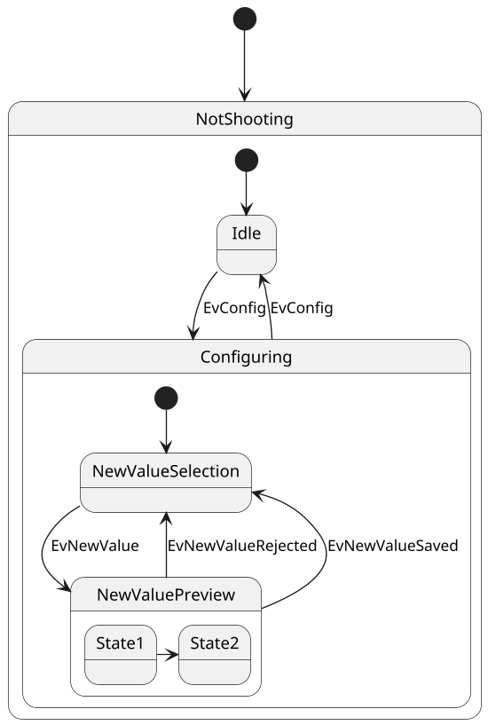
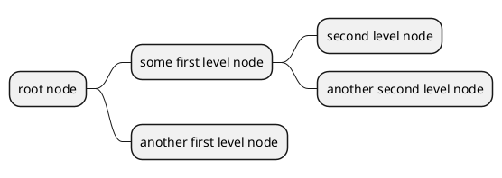
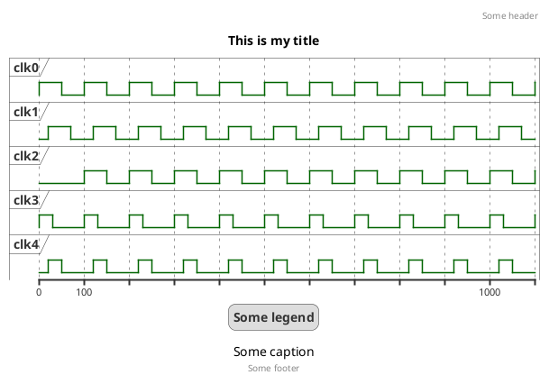
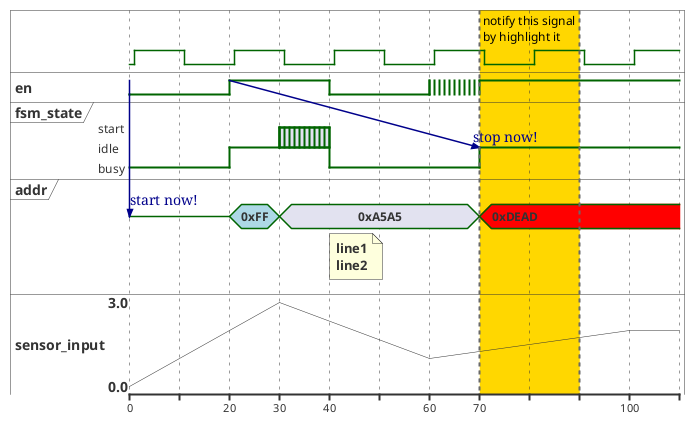
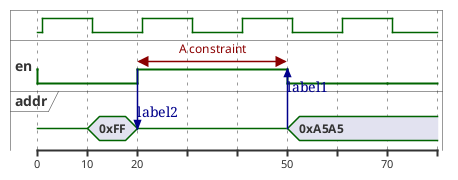
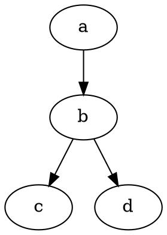

# MPE支持的Markdown样式

[TOC]

## 二级标题

### 三级标题[^注]

Typora支持的markdown语法参考[这里][1]和[github][2]

[也可以直接连到外部超链接和本地文件](https://www.baidu.com)

支持  _下杠斜_ __下杠黑__ *星号斜*  **星号黑** _斜体**黑体**嵌套_ <u>下划线</u>  ~~删除~~  ==高亮== `代码`  ~\~下标~ <sub>下标</sub> <sup>上标</sup>

emoji:slightly_smiling_face:可能有兼容性问题:bomb::smile_cat::arrow_left::arrow_right::arrow_upper_left::arrow_upper_right::rocket:

---

## 列表

- 无序列表
- 无序列表

1. 有序列表
2. 有序列表

- [ ] 待办事项
- [x] 待办事项

定义列表
: 第一行是要定义的名词，第二行跟:加空格，列出其定义
: 每个词可以有多种定义


> 引用
>
> > 多级引用
> >
> > - 引用中嵌套其他格式

---

## 表格

| 项目   |   价格 | 数量 |
| ------ | -----: | :--: |
| 计算机 | \$1600 |  5   |
| 手机   |   \$12 |  12  |
| 管线   |    \$1 | 234  |

---

## 嵌入本地和外部图片


---

## 代码和公式

### 公式

正文内嵌公式前后用单\$，如$E=mc^2$，独立行公式前后用双\$[^LaTeX]

$$
\Gamma _ { \epsilon } ( x ) = [ 1- e ^ { - 2\pi \epsilon } ] ^ { 1- x } \prod _ { n = 0} ^ { \infty } \frac { 1- \operatorname{exp} ( - 2\pi \epsilon ( n + 1) ) } { 1- \operatorname{exp} ( - 2\pi \epsilon ( x + n ) ) }
$$

$$
\mathbf{V}_1 \times \mathbf{V}_2 =  \begin{vmatrix}
\mathbf{i} & \mathbf{j} & \mathbf{k} \\
\frac{\partial X}{\partial u} &  \frac{\partial Y}{\partial u} & 0 \\
\frac{\partial X}{\partial v} &  \frac{\partial Y}{\partial v} & 0 \\
\end{vmatrix}
$$

$$
\ce{CH4 + 2 $\left( \ce{O2 + 79/21 N2} \right)$}
$$

### 代码

用'''包围要引用的代码块，并在开头的'''后加语言名以高亮渲染，*不支持其它代码内嵌方式*[^代码]

```python
@requires_authorization
class SomeClass:
    pass

if __name__ == '__main__':
    # A comment
    print 'hello world'
```

---

## 格式转换

### chrome
能用chrome转换的格式优先用chrome，几乎所有插件的格式都可以保留。

### pandoc
主要用来转word，转pdf用chrome更好。如果md包含mermaid，plantUML之类pandoc不支持的插件，可以先转成GFM再用pandoc转word。

需要在md文件开头处加front-matter。例如
```yaml
---
title: "MD格式与图形渲染"
author: John Doe
date: March 22, 2023
output:
  word_document: #输出格式，可以改成pdf_document，rtf_document等等
    # path: /Exports/markdown.docx #缺省与源文件在同一目录
    highlight: "tango" #代码高亮，还可以选zenburn
    toc: true #自动生成目录，md中的toc依然保留
    toc_depth: 2 #目录显示层数
    # reference_docx: mystyles.docx #使用该参考文件的格式设置
    # pandoc_args: ["--csl", "/var/csl/acs-nano.csl"] #定制pandoc的执行参数
---
```
缺省输出的格式比较难看，可以在word或wps中更换主题。

在当前目录中放一个`_output.yaml`，其配置参数会应用于该目录下的所有文件，如：
```yaml
word_document:
  highlight: zenburn
```
那么目录内所有md文件转换时会缺省使用zenburn配色渲染。注意该文件中不需要通常yaml的起始结束标记。

### markdown
这里的markdown指GFM(GitHub Flavored Markdown)，GFM不支持的渲染会被转成图片保存（mermaid之类会需要相应的命令行工具）。可以直接转换，也可以在md文件开头处加front-matter声明配置选项。
```yaml
---
markdown:
  image_dir: /test/assets
  path: /test/output.md
  ignore_from_front_matter: true
  absolute_image_path: false
---
```

---

## 图表

### 流程图用```flow开头[^流程图]

```flow
st=>start: 采购需求:>http://192.168.8.41:8080[blank]
e=>end 
op1=>operation: 打印入库单
op2=>operation: 申请人签收
验收入库
op3=>operation: 领用人提出出库申请
op4=>operation: 采购助理打印出库单:>这里假装是出库单链接
op5=>operation: 领用人签字
op6=>operation: 直属主管签字
para1=>parallel: 物料出库
op7=>operation: 领用人归还
sub1=>subroutine: 采购助理统
计采购清单
sub2=>subroutine: 财务工作

tianbiao=>operation: 填写申请表
并发邮件
cond1=>condition: 有合同
cond2=>condition: 金额>=2000
cond3=>condition: 研发采购
or 行政采购?
gm=>operation: 总经理审批
cto=>operation: CTO审批
admin=>operation: 行政主管审批
io=>inputoutput: 采购员采购
arrive=>operation: 物料到货

st->tianbiao->cond1
cond1(yes,right)->gm
cond1(no,bottom)->cond2
cond2(yes)->gm
cond2(no,bottom)->cond3
cond3(yes)->cto
cond3(no)->admin
gm->io
cto->io
admin->io
io->arrive
arrive->op1

op1->op2->op3->op4->op5->op6->para1
para1(path1)->sub1(right)->sub2(right)->e
para1(path2,right)->op7(top)->op1

```

### 序列图使用```[mermaid][3]语法[^序列图]



### 甘特图同样用[mermaid][3]语法



---

### uml和其它很多类型的图可以用[plantuml][5]

plantuml在Typora中不支持，vscode中的markdown preview enhanced插件可以部分支持但版本不是最新[^json]，[这里][6]有很多用例可以抄



#### 用[plantuml][5]画思维导图
可以用OrgMode或markdown格式，这里以markdown格式为例：


### 波形图可以用[plantuml][5]或者[wavedrom][7]实现

#### 用[plantuml][5]画波形图
官方说明见 https://plantuml.com/zh/timing-diagram

plantuml可以使用时间或者信号两种方式描述信号的时序关系，下面先基于**时间方式**举例，也就是在用`@`指定的每个时刻点，描述各个信号的取值。

`@`接立即数表示绝对时间，接`+x`表示相对上一个`@`时间点的offset。

无论时间还是信号都可以用`as`指定别名，时间的别名要以`:`开始，时间用别名的一个好处是可以用`别名-x`格式指定相对时间。

时钟信号使用`clock`关键词声明，`offset`设置相位（默认0），`pulse`设置脉宽（默认占空比50%），


[plantuml][5]中使用`binary`，`concise`和`robust`声明逻辑变量，`analog`声明模拟变量
`concise`：简明的图形化数据表示，可表示数据的移动（非常适合表示信息）。
`robust`：用信号线表示的状态，便于呈现状态间的转化（可设置多种状态）。
`binary`：二进制信号，只有两个状态。(binary)。
`analog`：无限多取值，在画图时会自动线性插值。

逻辑信号值使用`is`表达.

在两个信号变量之间使用`->`可以添加消息。无论消息发射方还是接收方都可以在变量名后面接绝对或相对时间，如：
`en->fsm@+50：stop now.`
表示消息的起点是当前时刻的en信号，终点是50单位以后的fsm信号。


**Tips：**

1. 初始值设置
在声明变量后，`@`标注时间前，使用*A is B*的格式，将A的初始值设置为B。不能对时钟信号设置初始值。

2. 不定态设置
使用`A is {X,Y}`的方式，将信号A的值设置在X和Y之间，表示一种不定范围。特殊的，`A is {-}`表示A是不定态或高阻。

**信号方式**与时间方式很类似，在`@信号名`下面指定不同时间的值即可，两种方式也可以混用。
特别的，`<->`表示约束关系，只能在基于信号方式的时序描述中，并且是同一个信号的不同时刻间使用。



#### 用[wavedrom][7]画波形图

眼下同样只有markdown preview enhanced插件支持，typora不支持

```wavedrom
{ signal: [
  { name: "pclk", wave: "p.....|..." },
  { name: "Pclk", wave: 'P.....|...' },
  { name: "nclk", wave: 'n.....|...' },
  { name: "Nclk", wave: 'N.....|...' },
  { name: 'clkx', wave: 'phnlzP|HNL' , phase: 0.25},
  {},
  { name: "Data",        wave: "x345x|=.ud", data: ["head", "body", "tail", "data"] },
  { name: "Request",     wave: "0.1..0|1.0" },
  {},
  { name: "Acknowledge", wave: "1.....|01." }
]}
```

```wavedrom
{ assign:[
  ["out",
    ["|",
      ["^", ["~", "a"], "b"],
      ["&", ["~", "b"], "a"]
    ]
  ]
]}
```

### dot画图
用dot或viz表示的dot语言块在MPE中都能调用viz.js渲染（typora不支持），用`dot {engine="xxx"}`可以指定渲染引擎，支持的渲染引擎包括circo, dot, neato, osage, 和twopi，缺省引擎是dot




### 统计图用[vega-lite][8]或[vega][9]

眼下同样只有markdown preview enhanced插件支持，typora不支持，vega-lite在MPE上还有问题

```vega
{
  "$schema": "https://vega.github.io/schema/vega/v5.json",
  "description": "A basic stacked bar chart example.",
  "width": 500,
  "height": 200,
  "padding": 5,

  "data": [
    {
      "name": "table",
      "values": [
        {"x": 0, "y": 28, "c": 0}, {"x": 0, "y": 55, "c": 1},
        {"x": 1, "y": 43, "c": 0}, {"x": 1, "y": 91, "c": 1},
        {"x": 2, "y": 81, "c": 0}, {"x": 2, "y": 53, "c": 1},
        {"x": 3, "y": 19, "c": 0}, {"x": 3, "y": 87, "c": 1},
        {"x": 4, "y": 52, "c": 0}, {"x": 4, "y": 48, "c": 1},
        {"x": 5, "y": 24, "c": 0}, {"x": 5, "y": 49, "c": 1},
        {"x": 6, "y": 87, "c": 0}, {"x": 6, "y": 66, "c": 1},
        {"x": 7, "y": 17, "c": 0}, {"x": 7, "y": 27, "c": 1},
        {"x": 8, "y": 68, "c": 0}, {"x": 8, "y": 16, "c": 1},
        {"x": 9, "y": 49, "c": 0}, {"x": 9, "y": 15, "c": 1}
      ],
      "transform": [
        {
          "type": "stack",
          "groupby": ["x"],
          "sort": {"field": "c"},
          "field": "y"
        }
      ]
    }
  ],

  "scales": [
    {
      "name": "x",
      "type": "band",
      "range": "width",
      "domain": {"data": "table", "field": "x"}
    },
    {
      "name": "y",
      "type": "linear",
      "range": "height",
      "nice": true, "zero": true,
      "domain": {"data": "table", "field": "y1"}
    },
    {
      "name": "color",
      "type": "ordinal",
      "range": "category",
      "domain": {"data": "table", "field": "c"}
    }
  ],

  "axes": [
    {"orient": "bottom", "scale": "x", "zindex": 1},
    {"orient": "left", "scale": "y", "zindex": 1}
  ],

  "marks": [
    {
      "type": "rect",
      "from": {"data": "table"},
      "encode": {
        "enter": {
          "x": {"scale": "x", "field": "x"},
          "width": {"scale": "x", "band": 1, "offset": -1},
          "y": {"scale": "y", "field": "y0"},
          "y2": {"scale": "y", "field": "y1"},
          "fill": {"scale": "color", "field": "c"}
        },
        "update": {
          "fillOpacity": {"value": 1}
        },
        "hover": {
          "fillOpacity": {"value": 0.5}
        }
      }
    }
  ]
}

```

### 其它
GitHub Markdown支持用geojson和topojson显示地图，还可以用stl生成3D模型，见[这里][10]。但MPE都还没有支持。

[^注]: 最多支持六级小标题。
[^LaTeX]: 支持 **LaTeX** 编辑显示，例如：$\sum_{i=1}^n a_i=0$， 访问 [MathJax][4] 参考更多使用方法。

[^代码]: typora支持高亮的语言列表及代码见[这里](http://support.typora.io/Code-Fences-Language-Support/)。
[^流程图]: 用[flowchart.js](https://github.com/adrai/flowchart.js/)渲染，也支持[mermaid][3]的flowchart
[^序列图]: 详细语法见https://github.com/mermaid-js/mermaid/blob/develop/docs/sequenceDiagram.md，另外也支持[js-sequence](https://bramp.github.io/js-sequence-diagrams/)
[^json]: 例如startjson就不支持～

[1]: http://support.typora.io/
[2]: https://help.github.com/en/categories/writing-on-github
[3]: https://mermaid-js.github.io/mermaid/#/
[4]: http://meta.math.stackexchange.com/questions/5020/mathjax-basic-tutorial-and-quick-reference
[5]: https://plantuml.com/zh/
[6]: https://real-world-plantuml.com/
[7]: https://wavedrom.com/tutorial.html
[8]: https://vega.github.io/vega-lite/
[9]: https://vega.github.io/vega/
[10]: https://docs.github.com/en/get-started/writing-on-github/working-with-advanced-formatting/creating-diagrams