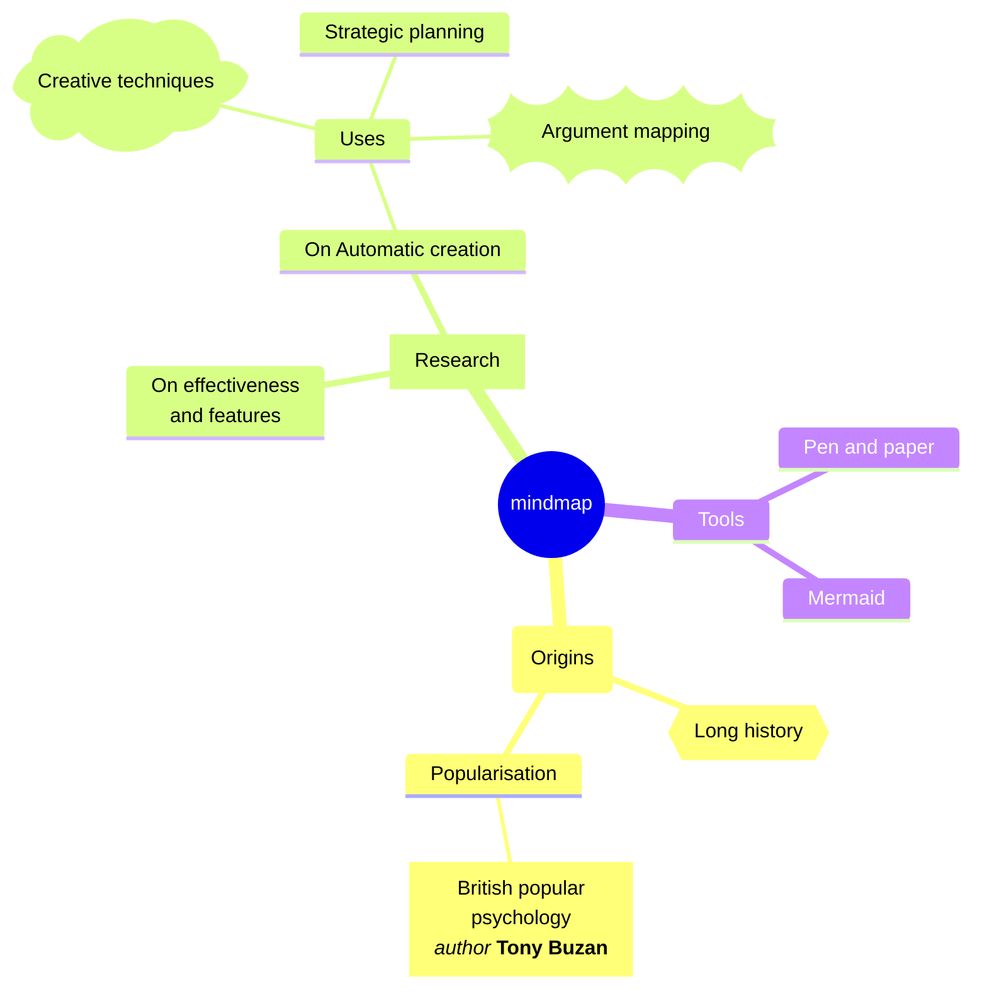
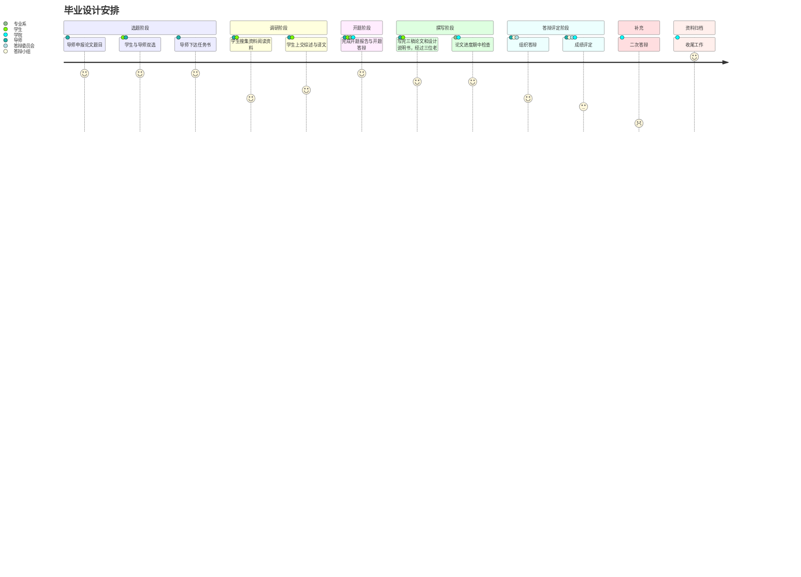
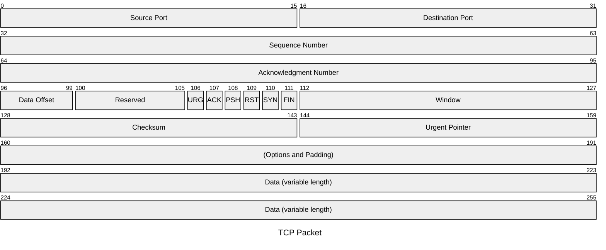
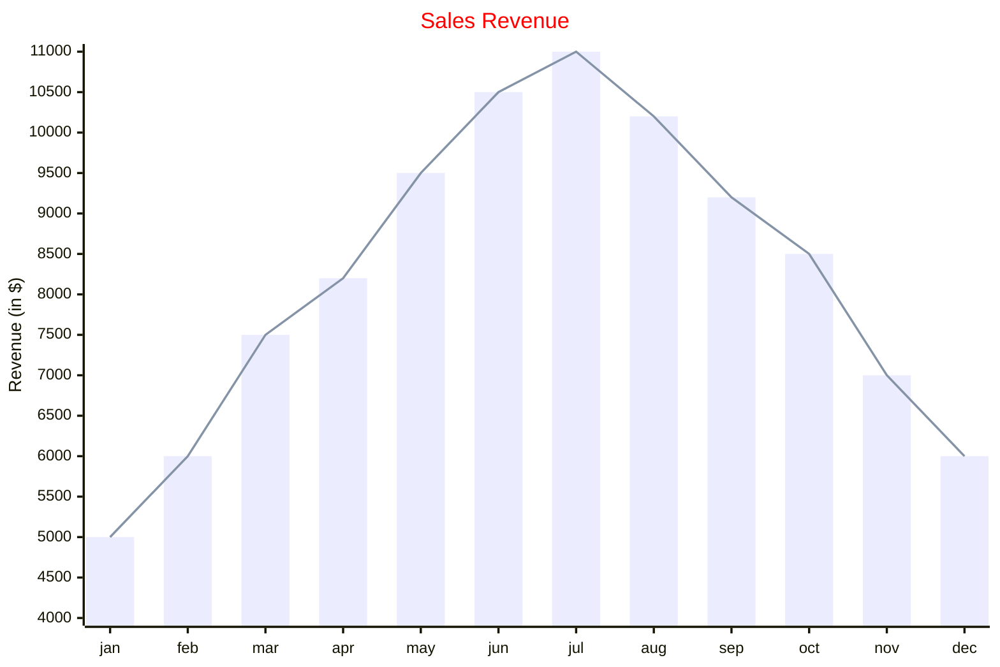
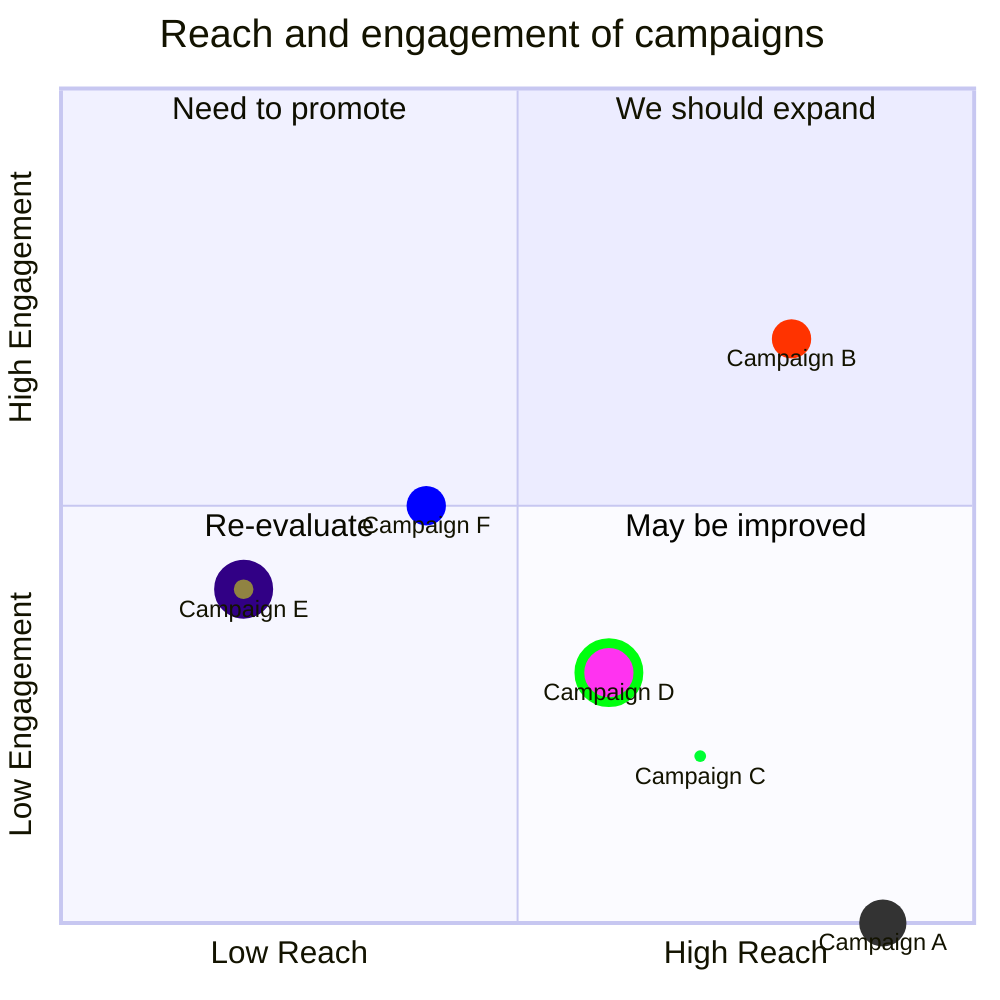
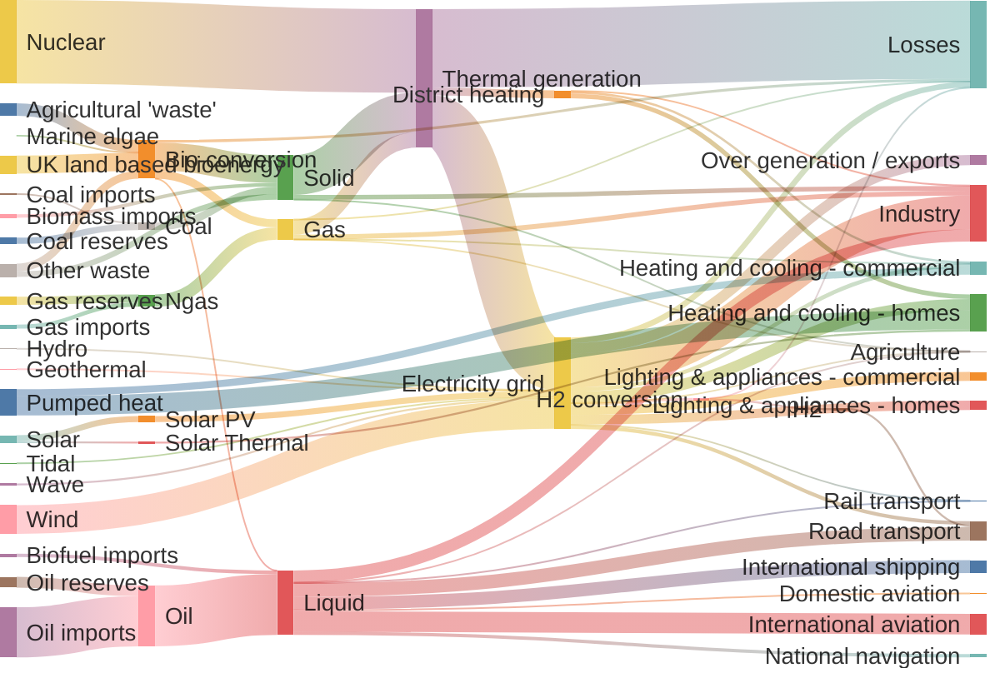

# MPE支持的Markdown样式

[TOC]

## 二级标题

### 三级标题[^注]

Typora支持的markdown语法参考[这里][1]和[github][2]

[也可以直接连到外部超链接和本地文件](https://www.baidu.com)

支持  _下杠斜_ __下杠黑__ *星号斜*  **星号黑** _斜体**黑体**嵌套_ <u>下划线</u>  ~~删除~~  ==高亮== `代码`  ~\~下标~ <sub>下标</sub> <sup>上标</sup>

emoji:slightly_smiling_face:可能有兼容性问题:bomb::smile_cat::arrow_left::arrow_right::arrow_upper_left::arrow_upper_right::rocket:

---

## 列表

- 无序列表
- 无序列表

1. 有序列表
2. 有序列表

- [ ] 待办事项
- [x] 待办事项

定义列表
: 第一行是要定义的名词，第二行跟:加空格，列出其定义
: 每个词可以有多种定义


> 引用
>
> > 多级引用
> >
> > - 引用中嵌套其他格式

---

## 表格

| 项目   |   价格 | 数量 |
| ------ | -----: | :--: |
| 计算机 | \$1600 |  5   |
| 手机   |   \$12 |  12  |
| 管线   |    \$1 | 234  |

如果想支持合并单元格，需要在MPW插件的setting中打开enableExtendedTableSyntax

| Column 1 | Column 2 | Column 3 |
| ------ | -----: | :--: |
| A1 |  |
| A2 | > |  C2  |
| > | B3   | C3 |

| Column 1 | Column 2 | Column 3 |
| ------ | -----: | :--: |
| A1 | B1 | C1 |
| ^ | ^ |  C2  |
| ^ | B3   |  |

---

## 嵌入本地和外部图片


---

## 代码和公式

### 公式

正文内嵌公式前后用单\$，如$E=mc^2$，独立行公式前后用双\$[^LaTeX]

$$
\Gamma _ { \epsilon } ( x ) = [ 1- e ^ { - 2\pi \epsilon } ] ^ { 1- x } \prod _ { n = 0} ^ { \infty } \frac { 1- \operatorname{exp} ( - 2\pi \epsilon ( n + 1) ) } { 1- \operatorname{exp} ( - 2\pi \epsilon ( x + n ) ) }
$$

$$
\mathbf{V}_1 \times \mathbf{V}_2 =  \begin{vmatrix}
\mathbf{i} & \mathbf{j} & \mathbf{k} \\
\frac{\partial X}{\partial u} &  \frac{\partial Y}{\partial u} & 0 \\
\frac{\partial X}{\partial v} &  \frac{\partial Y}{\partial v} & 0 \\
\end{vmatrix}
$$

$$
\ce{CH4 + 2 $\left( \ce{O2 + 79/21 N2} \right)$}
$$

### 代码

用'''包围要引用的代码块，并在开头的'''后加语言名以高亮渲染，*不支持其它代码内嵌方式*[^代码]

```python
@requires_authorization
class SomeClass:
    pass

if __name__ == '__main__':
    # A comment
    print 'hello world'
```

---

## 格式转换

### chrome
能用chrome转换的格式优先用chrome，几乎所有插件的格式都可以保留。

### pandoc
主要用来转word，转pdf用chrome更好。如果md包含mermaid，plantUML之类pandoc不支持的插件，可以先转成GFM再用pandoc转word。

需要在md文件开头处加front-matter。例如
```yaml
---
title: "MD格式与图形渲染"
author: John Doe
date: March 22, 2023
output:
  word_document: #输出格式，可以改成pdf_document，rtf_document等等
    # path: /Exports/markdown.docx #缺省与源文件在同一目录
    highlight: "tango" #代码高亮，还可以选zenburn
    toc: true #自动生成目录，md中的toc依然保留
    toc_depth: 2 #目录显示层数
    # reference_docx: mystyles.docx #使用该参考文件的格式设置
    # pandoc_args: ["--csl", "/var/csl/acs-nano.csl"] #定制pandoc的执行参数
---
```
缺省输出的格式比较难看，可以在word或wps中更换主题。

在当前目录中放一个`_output.yaml`，其配置参数会应用于该目录下的所有文件，如：
```yaml
word_document:
  highlight: zenburn
```
那么目录内所有md文件转换时会缺省使用zenburn配色渲染。注意该文件中不需要通常yaml的起始结束标记。

### markdown
这里的markdown指GFM(GitHub Flavored Markdown)，GFM不支持的渲染会被转成图片保存（mermaid之类会需要相应的命令行工具）。可以直接转换，也可以在md文件开头处加front-matter声明配置选项。
```yaml
---
markdown:
  image_dir: /test/assets
  path: /test/output.md
  ignore_from_front_matter: true
  absolute_image_path: false
---
```

---

## 图表
大部分用[mermaid][3]实现，部分用到wavedrom和dot。mermaid的自定义配色方案参考[这里][6]。

### 流程图
除开基本形状，还有大量用`@{ shape:`开头的扩充节点，种类繁多，可查[在线文档][8]。


### 序列图


---

### 甘特图


---


### 思维导图
直接通过缩进控制层级，可以复用流程图的部分形状符号，label中也可以使用markdown语法：


### 波形图可以用[plantuml][5]或者[wavedrom][7]实现

#### 用[plantuml][5]画波形图（不如wavedrom，删掉了）
官方说明见 https://plantuml.com/zh/timing-diagram


#### 用[wavedrom][7]画波形图（可以嵌入js）

眼下同样只有markdown preview enhanced插件支持，typora不支持

```wavedrom
{ signal: [
  { name: "pclk", wave: "p.....|..." },
  { name: "Pclk", wave: 'P.....|...' },
  { name: "nclk", wave: 'n.....|...' },
  { name: "Nclk", wave: 'N.....|...' },
  { name: 'clkx', wave: 'phnlzP|HNL' , phase: 0.25},
  {},
  { name: "Data",        wave: "x345x|=.ud", data: ["head", "body", "tail", "data"] },
  { name: "Request",     wave: "0.1..0|1.0" },
  {},
  { name: "Acknowledge", wave: "1.....|01." }
]}
```

```wavedrom
{ assign:[
  ["out",
    ["|",
      ["^", ["~", "a"], "b"],
      ["&", ["~", "b"], "a"]
    ]
  ]
]}
```

```wavedrom
{
  signal:[
    //clock generation
    function clockGen(clockName,repeatNum){
      var clock={name:clockName,wave:'p'+'.'.repeat(repeatNum-1)};
      return clock
    }('clk',16),
    //reset generation
    function resetGen(repeatNum,resetName,resetActiveLevel,resetAssertCycle){
      var reset={name:resetName,wave:''};
      reset.wave+=resetActiveLevel+''+'.'.repeat(resetAssertCycle-1)+(1-resetActiveLevel)+''+'.'.repeat(repeatNum-resetAssertCycle-1);
      return reset;
    }(16,'rst',1,5),
    //data generation
    function dataGen(cycleNum,startCycle,activeCycle,signalNum){
      var signalList=[]
      //signal name generation

      //valid generation
      signalList.push(
        {name:"valid",wave: '0'+ '.'.repeat(startCycle-1) + '1' + '.'.repeat(activeCycle-1) + '0'+'.'.repeat(cycleNum-startCycle-activeCycle-1)}
      );
      //data generation
      for(var signalIndex=0;signalIndex <signalNum;signalIndex++){
        signalList.push({name:"data"+signalIndex+'',wave:'',data:[]} )
        for(var cycleIndex=0;cycleIndex< cycleNum;cycleIndex++){
          signalList[signalIndex+1].wave+=(Math.floor(Math.random() * 8) + 2)+'';
          signalList[signalIndex+1].data.push((cycleIndex*signalNum+signalIndex)+'');
        }
      }
      signalList.unshift('bus');
      return signalList
    }(16,5,6,32)
  ]
}
```

### dot画图
用dot或viz表示的dot语言块在MPE中都能调用viz.js渲染（typora不支持），用`dot {engine="xxx"}`可以指定渲染引擎，支持的渲染引擎包括circo, dot, neato, osage, 和twopi，缺省引擎是dot


### 行程图


---

### 数据包图


### XY图（当下只支持柱状和折线图）


### 象限图


### 桑基图
将数据保存为`source,target,value`格式的csv文件，直接粘贴进来就可以


### 其它
GitHub Markdown支持用geojson和topojson显示地图，还可以用stl生成3D模型，见[这里][10]。但MPE都还没有支持。

[^注]: 最多支持六级小标题。
[^LaTeX]: 支持 **LaTeX** 编辑显示，例如：$\sum_{i=1}^n a_i=0$， 访问 [MathJax][4] 参考更多使用方法。
[^代码]: typora支持高亮的语言列表及代码见[这里](http://support.typora.io/Code-Fences-Language-Support/)。

[^序列图]: 详细语法见https://github.com/mermaid-js/mermaid/blob/develop/docs/sequenceDiagram.md，另外也支持[js-sequence](https://bramp.github.io/js-sequence-diagrams/)
[^json]: 例如startjson就不支持～

[1]: http://support.typora.io/
[2]: https://help.github.com/en/categories/writing-on-github
[3]: https://mermaid.js.org/intro/
[4]: http://meta.math.stackexchange.com/questions/5020/mathjax-basic-tutorial-and-quick-reference
[5]: https://plantuml.com/zh/
[6]: https://mermaid.js.org/config/theming.html
[7]: https://wavedrom.com/tutorial.html
[8]: https://mermaid.js.org/syntax/flowchart.html
[9]: https://vega.github.io/vega/
[10]: https://docs.github.com/en/get-started/writing-on-github/working-with-advanced-formatting/creating-diagrams