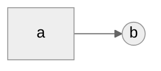
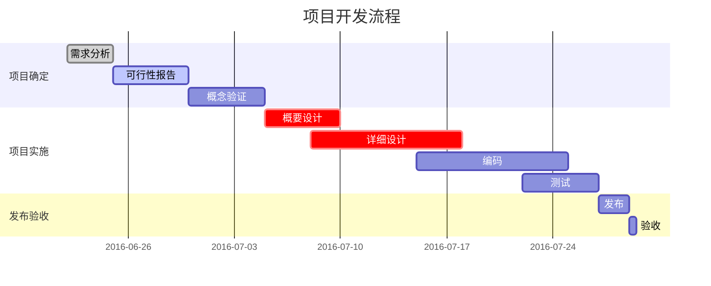
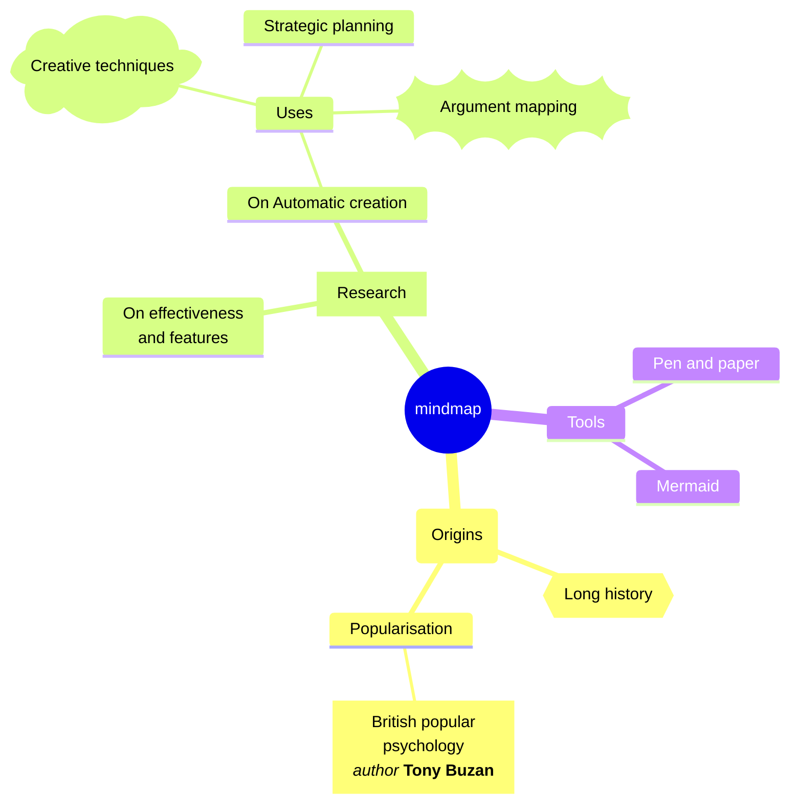
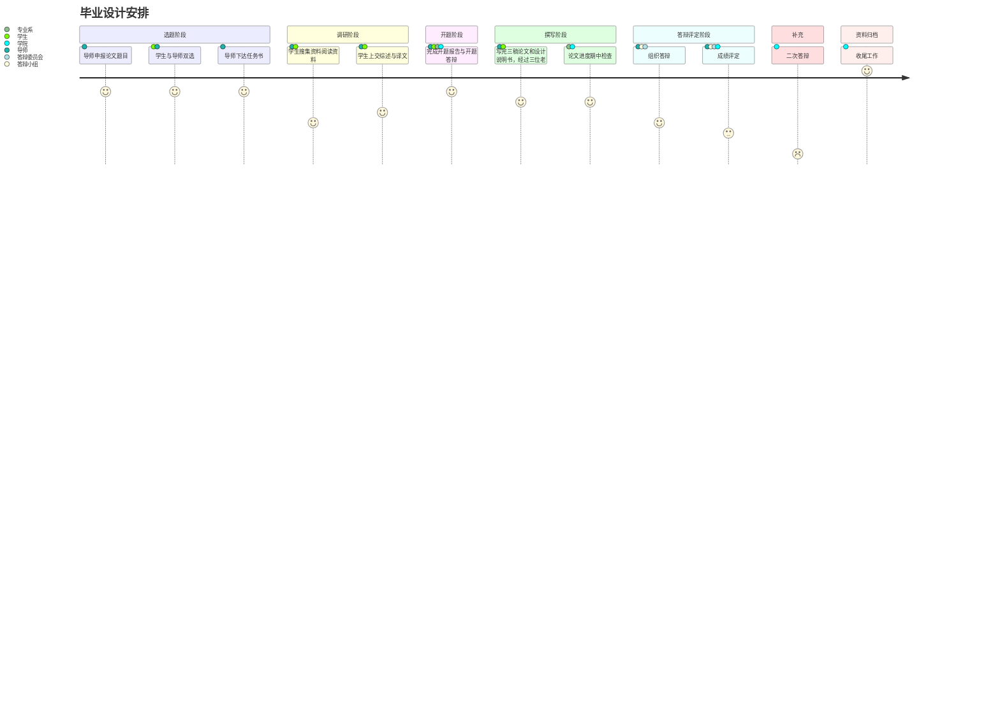
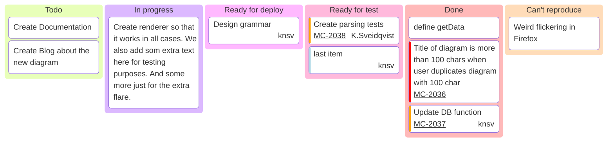
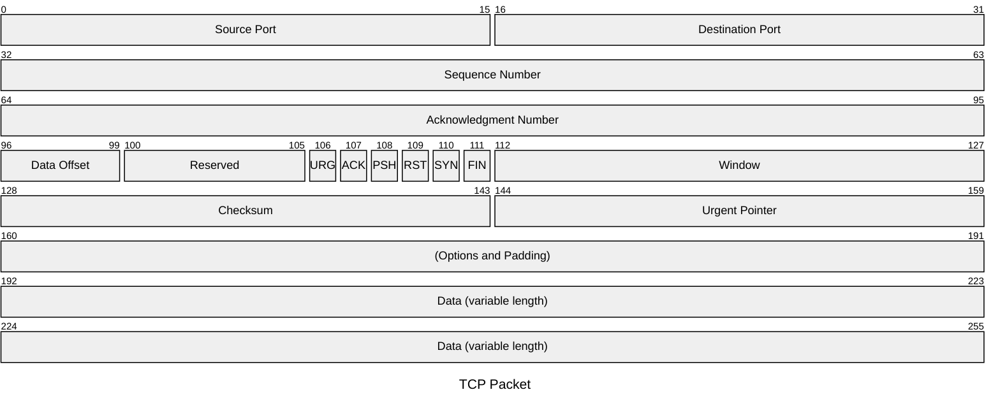
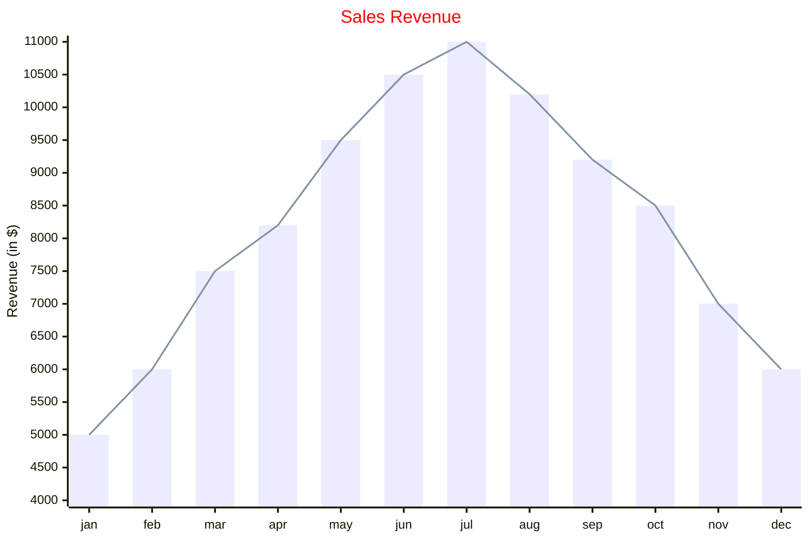
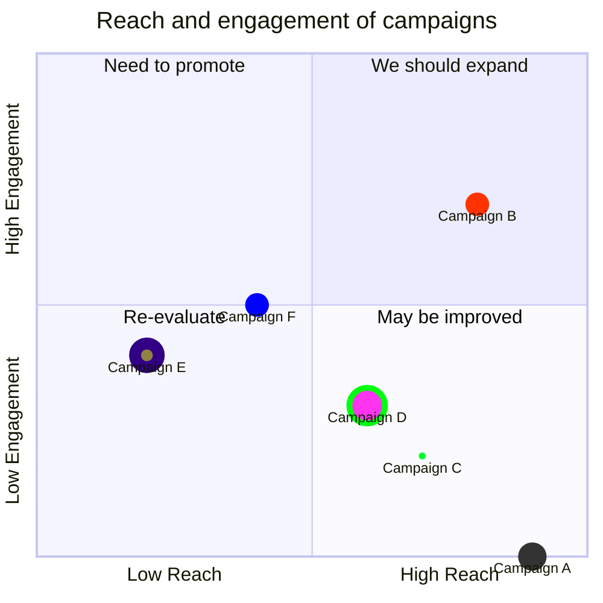
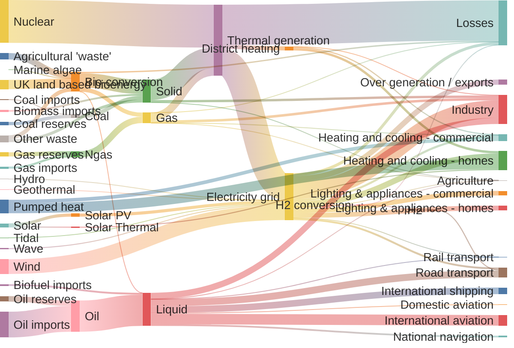

Mermaid可以实现很多常用的图表，但因为markdown文件是作为一个整体渲染的，实时渲染太多会严重影响页面打开速度，如果需要在单个文件中插入大量图表，依然建议使用静态图像。

### 甘特图

### 思维导图
直接通过缩进控制层级，可以复用流程图的部分形状符号，label中也可以使用markdown语法：

### 行程图

### 看板图

### 数据包图

### XY图（当下只支持柱状和折线图）

### 象限图

### 桑基图
将数据保存为`source,target,value`格式的csv文件，直接粘贴进来就可以。
